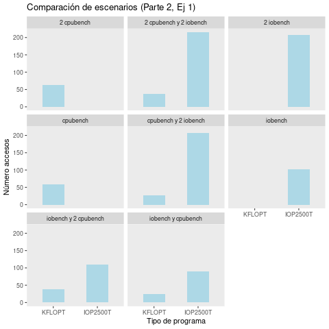
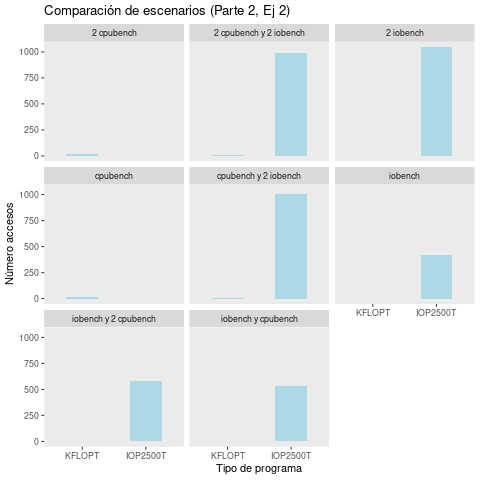
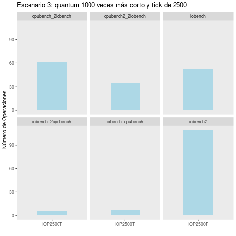

# Sistemas Operativos: Laboratorio 3 (MLFQ) #

Los objetivos de este laboratorio son estudiar el funcionamiento del *scheduler* original de xv6; analizar los procesos que se benefician/perjudican con esta decisión de diseño; por último desarrollar una implementación que mejore esta situación reemplazando la política de planificación por una propia que deberá respetar ciertos condiciones

## Primera Parte: Estudiando el planificador de xv6.

### 1. Analizar el código del planificador y responda:
- ¿Qué política utiliza `xv6` para elegir el próximo proceso a correr?

El sistema operativo `xv6` presenta un planificador del tipo Round Robin (RR), la implementación se encuentra en `proc.c` más precisamente en la función `scheduler()`. A simple vista en la función se observan dos *loops*, el primero o principal que se caracteriza por ser infinito esto hace que el  *scheduler* nunca regrese. Antes de entrar al *loop* secundario el *scheduler* obtiene el `ptable.lock`, que puede evitar que otras CPU modifiquen el estado del proceso en la tabla de punteros de proceso y evitar conflictos de datos. Después de ingresar al ciclo, se recorren los procesos en la tabla de procesos en orden.

Cuando encuentra que el estado de un proceso es *runnable* se cambia el puntero del proceso actualmente en ejecución de esta CPU al puntero del proceso seleccionado, luego cambia al espacio de memoria virtual del usuario del proceso y por último cambia el estado del proceso a en ejecución.

Después de completar las operaciones anteriores, se llama a la función `swtch` para cambiar el contexto. Este es el planificador que comenzará a ejecutarse, después de cambiar al espacio de memoria virtual del *kernel* y vaciar el proceso en ejecución en la CPU actual, ingresa al siguiente ciclo.

Se puede observar que aunque el algoritmo RR implementado por el sistema `xv6` no organiza la cola de listas según el principio de *First Come First Served* (FCFS). En cambio, se ordenan en un orden fijo, es decir, el orden de los procesos en la tabla de procesos, tal desviación no causa inanición, y la implementación aún puede garantizar que cada proceso en la cola lista pueda obtener el derecho a usar la CPU dentro del tiempo esperado.

### 2. Analizar el código que interrumpe a un proceso al final de su quantum y responda:

- ¿Cuánto dura un *quantum* en `xv6`?

En *quantum* de `xv6` tiene una duración de 10 ms para cada procesador. Esto se puede ver en el archivo `lapic.c` con el registro `TICR` que luego por medio de la función `lapicw` se emite la interrupción.

- ¿Hay alguna forma de que a un proceso se le asigne menos tiempo?

Una forma de asignarle menos tiempo aun proceso es reduciendo el *quantum* afectando directamente su tiempo de ejecución. Otra forma es aumentando la cantidad de *TICKS* de un proceso determinando.

## Segunda Parte: Cómo el planificador afecta a los procesos.

### 1. Respuesta de I/O y el poder de cómputo obtenido para las distintas combinaciones de iobench y cpubench:

En la siguiente figura se observan distintos escenarios que ponen a prueba la respuesta de I/O y el poder de cómputo para las distintas combinaciones posibles entre 0 y 2 `ìobench` junto con 0 y 2 de `cpubench`, medidas en IOP250T y KFLOPT respectivamente. Los escenarios fueron simulados con un *quantum* de 10ms y 250 de *TICKS*.

Entonces, en el primer escenario donde corre un programa `cpubench` podemos ver que el número de operaciones promedio es de 52 aproximadamente medidas en KFLOPT, este resultado es similar al coso de `2 cpubench`. A su vez en el segundo que tenemos `1 cpubench` y `2 iobench` observamos que los programas `ìobench` realizan el triple de operaciones promedio que el programa `cpubench` esta relación se mantiene en las demás situaciones `2cpubench` con `2 iobench`, `iobench` con `2 cpubench` e `iobench` con `cpubench` pero con menos fuerza.

Se evidencia que cuando hay más procesos `ìobench` que `cpubench` los primeros realizan un mayor número de operaciones en promedio, pero cuando la proporción es la misma o inversa está diferencia tiende a reducirse.

Como conclusión podemos decir que los procesos `iobench` realizan en promedio un número mayor de operaciones, esto también se pude ver en los escenarios `1 cpubench` y `2 cpubench`.

### 2. Para quantums 10, 100 y 1000 veces más cortos.

Para estos escenario cambiamos el *quantum* por defecto de xv6 y también los *TICKS* de los programas `iobench` y `cpubench` para que pueden tener un comportamiento similar al escenario expuesto en el punto anterior y permitir comparaciones.

### Escenario 1: *quantum* 10 con 2500 *TICKS*

En la siguiente figura se esbozan los escenarios con un *quantum* 10 veces más corto. Notamos que tienen un comportamiento similar al escenario expuesto en el punto previo, los procesos `iobench` reaccionan de la misma forma en relación al número de operaciones. Para los procesos `cpubench` se observa una reducción en el número de operaciones promedio principalmente cuando se ejecutan simultaneamento con procesos `iobench`, como es el caso de los escenarios `cpubench` con `2 iobench`, `2 cpubench` con `2 iobench`, `2 cpubench` con `iobench` y `cpubench` con `iobench`.  

### Escenario 2: *quantum* 100 con 2500 *TICKS*

Ahora con un *quantum* 100 veces menor, en la siguiente figura notamos un gran cambio en los escenarios, principalmente con los procesos `cpubench` que reducen drástricamente el número de operaciones promedio y por ende los `iobench` aumentan el número de operaciones.

### Escenario 3: *quantum* 1000 con 2500 *TICKS*

Por último, con un *quantum* 1000 menor observamos que los procesos `cpubench` no realizan ninguna operación en ninguno de los escenarios. Por otra parte los `iobench` también reducen sus operaciones promedio en relación a los demás escenarios. Esto nos dice que al reducir cada vez más el *quantum* del *scheduler* ambos procesos reducen cada vez más el número de operaciones.

