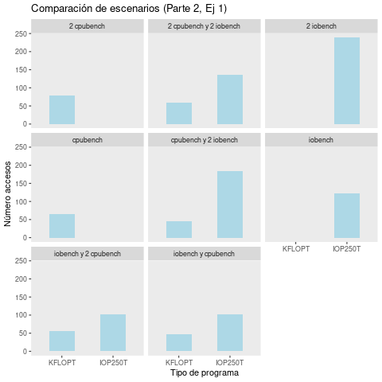
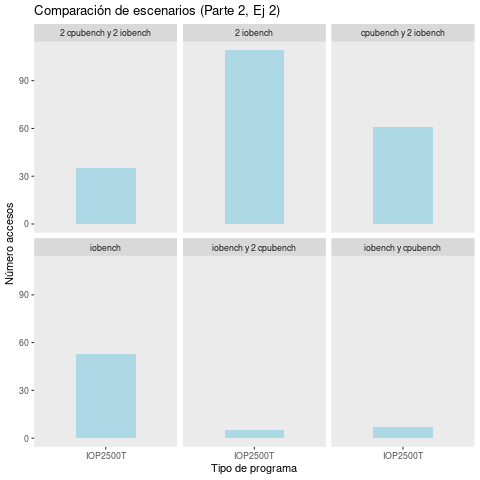
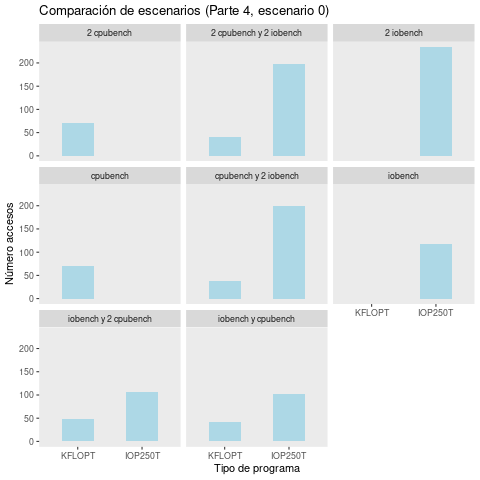
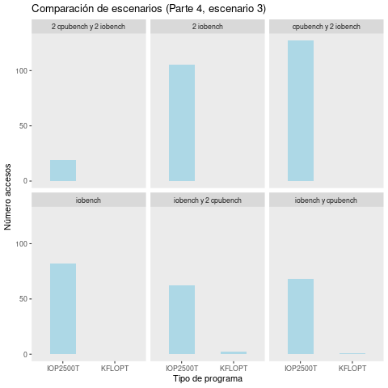

# Sistemas Operativos: Laboratorio 3 (MLFQ) #

Los objetivos de este laboratorio son estudiar el funcionamiento del *scheduler* original de xv6; analizar los procesos que se benefician/perjudican con esta decisión de diseño; por último desarrollar una implementación que mejore esta situación reemplazando la política de planificación por una propia que deberá respetar ciertos condiciones

## Primera Parte: Estudiando el planificador de xv6.

### 1. Analizar el código del planificador y responda:
- ¿Qué política utiliza `xv6` para elegir el próximo proceso a correr?

El sistema operativo `xv6` presenta un planificador del tipo Round Robin (RR), la implementación se encuentra en `proc.c` más precisamente en la función `scheduler()`. A simple vista en la función se observan dos *loops*, el primero o principal que se caracteriza por ser infinito esto hace que el  *scheduler* nunca regrese. Antes de entrar al *loop* secundario el *scheduler* obtiene el `ptable.lock`, que puede evitar que otras CPU modifiquen el estado del proceso en la tabla de punteros de proceso y evitar conflictos de datos. Después de ingresar al ciclo, se recorren los procesos en la tabla de procesos en orden.

Cuando encuentra que el estado de un proceso es *runnable* se cambia el puntero del proceso actualmente en ejecución de esta CPU al puntero del proceso seleccionado, luego cambia al espacio de memoria virtual del usuario del proceso y por último cambia el estado del proceso a en ejecución.

Después de completar las operaciones anteriores, se llama a la función `swtch` para cambiar el contexto. Este es el planificador que comenzará a ejecutarse, después de cambiar al espacio de memoria virtual del *kernel* y vaciar el proceso en ejecución en la CPU actual, ingresa al siguiente ciclo.

Se puede observar que aunque el algoritmo RR implementado por el sistema `xv6` no organiza la cola de listas según el principio de *First Come First Served* (FCFS). En cambio, se ordenan en un orden fijo, es decir, el orden de los procesos en la tabla de procesos, tal desviación no causa inanición, y la implementación aún puede garantizar que cada proceso en la cola lista pueda obtener el derecho a usar la CPU dentro del tiempo esperado.

### 2. Analizar el código que interrumpe a un proceso al final de su quantum y responda:

- ¿Cuánto dura un *quantum* en `xv6`?

En *quantum* de `xv6` tiene una duración de 10 ms para cada procesador. Esto se puede ver en el archivo `lapic.c` con el registro `TICR` que luego por medio de la función `lapicw` se emite la interrupción.

- ¿Hay alguna forma de que a un proceso se le asigne menos tiempo?

Una forma de asignarle menos tiempo aun proceso es reduciendo el *quantum* afectando directamente su tiempo de ejecución. Otra forma es aumentando la cantidad de *TICKS* de un proceso determinando.

## Segunda Parte: Cómo el planificador afecta a los procesos.

### 1. Respuesta de I/O y el poder de cómputo obtenido para las distintas combinaciones de iobench y cpubench:

En la siguiente tabla se observan distintos escenarios que ponen a prueba la respuesta de I/O y el poder de cómputo para las distintas combinaciones posibles entre 0 y 2 `ìobench` junto con 0 y 2 de `cpubench`, medidas en IOP250T y KFLOPT respectivamente. Los escenarios fueron simulados con un *quantum* de 10ms y 250 de *TICKS*.

Entonces, en el primer escenario donde corre un programa `cpubench` podemos ver que el número de operaciones promedio es de 438.2121s KFLOPT, este resultado es aproximadamente el doble al caso de `2 cpubench`. A su vez `cpubench` y `2 iobench` observamos que los programas `ìobench` están muy por debajo del número de operaciones que el programa `cpubench` esta relación se mantiene en los casos `2 cpubench` y `2 iobench` pero en menos proporción, asi como también en `2 cpubench` y `iobench`.

Por otra parte, cuando corremos solo un proceso `iobench` el promedio de operaciones en aproximadamente 10 veces mayor que si estuvieramos ejeucutanto un programa `cpubench`.

| Escenario              | Promedio de KFLOPT | Promedio De IOP250T |
|------------------------|--------------------|---------------------|
| cpubench               |      438.2121      |          -          |
| cpubench y 2 iobench   |      311.1957      |       119.0815      |
| 2 cpubench             |      262.8734      |          -          |
| 2 cpubench y 2 iobench |      199.0172      |       74.8000       |
| iobench                |          -         |      3431.1721      |
| 2 cpubench y iobench   |      198.9107      |       75.9604       |
| cpubench y iobench     |      316.6087      |       134.4951      |
| 2 iobench              |          -         |      2654.4979      |

En la siguiente figura se muestan los accesos de los diferentes escenarios. Se evidencia que cuando hay más procesos `ìobench` que `cpubench` los primeros realizan un mayor número de accesos, pero cuando la proporción es la misma o inversa está diferencia tiende a reducirse.

Como conclusión podemos decir que los procesos `iobench` realizan en promedio un número mayor de accesos, que los procesos `cpubench`. Pero estos últimos a pesar de hacer un menor número de accesos realizan más operaciones en promedio si se encuentran corriendo en simultaneo con procesos `iobench`

### 2. Para quantums 10, 100 y 1000 veces más cortos.

Para estos escenario cambiamos el *quantum* por defecto de xv6 y también los *TICKS* de los programas `iobench` y `cpubench` para que pueden tener un comportamiento similar al escenario expuesto en el punto anterior y permitir comparaciones.

### Escenario 1: *quantum* 10 con 2500 *TICKS*

En la siguiente tabla se esbozan los escenarios con un *quantum* 10 veces más corto, podemos ver cuando se corren `cpubench` con `2 iobench` a diferencia del punto anterios ahora los programas `iobench` en promedio realizan más operaciones que los `cpubench`, esta relación se mantiene en todos los escenarios. Y cuando corremos solo procesos `cpubench` realizan consideramente menos operaciones en promedio que el caso anterior, y los programas `iobench` incrementan sustancialmente.

| Escenario              | Promedio de KFLOPT | Promedio De IOP250T |
|------------------------|--------------------|---------------------|
| cpubench               |      39.10345      |          -          |
| cpubench y 2 iobench   |      19.85185      |       647.65534     |
| 2 cpubench             |      21.96774      |          -          |
| 2 cpubench y 2 iobench |      13.48649      |       347.38605     |
| iobench                |          -         |      3329.32039     |
| 2 cpubench y iobench   |      13.65789      |       567.57273     |
| cpubench y iobench     |      21.08333      |      1067.71111     |
| 2 iobench              |          -         |      2936.68269     |

Los accesos los presentamos en la siguiente figura donde los procesos `iobench` reaccionan de la misma forma que el inciso anteriors. Para los procesos `cpubench` se observa una reducción en el número de accesos principalmente cuando se ejecutan simultaneamento con procesos `iobench`, como es el caso de los escenarios `cpubench` con `2 iobench`, `2 cpubench` con `2 iobench`, `2 cpubench` con `iobench` y `cpubench` con `iobench`.  

### Escenario 2: *quantum* 100 con 2500 *TICKS*

Ahora con un *quantum* 100 veces menor, en la siguiente tabla observamos que los procesos `cpubench` no realizan operaciones en ninguno de los escenarios. Por otra parte los procesos `iobench` si realizan operaciones pero en promedio mucho menores en relación a la situación anterior (*quantum* 10 veces menor).

| Escenario              | Promedio de KFLOPT | Promedio De IOP250T |
|------------------------|--------------------|---------------------|
| cpubench               |      1.00000       |          -          |
| cpubench y 2 iobench   |      0.00000       |       60.06281      |
| 2 cpubench             |      0.00000       |          -          |
| 2 cpubench y 2 iobench |      0.00000       |       43.18845      |
| iobench                |          -         |       32.84323      |
| 2 cpubench y iobench   |      0.00000       |       46.89119      |
| cpubench y iobench     |      0.00000       |       58.79584      |
| 2 iobench              |          -         |       97.177991     |

En la siguiente figura donde se presentan los accesos de los programas, notamos un gran cambio en los escenarios, principalmente con los procesos `cpubench` que reducen drástricamente y los `iobench` aumentan considerablemente. Podemos decir que por la reducción del *quamtum* aún que los procesos `cpubench` hacen acceso, estos no realizan operaciones, en cambio los procesos `iobench` realizan operaciones pero en menor medida comparadas con las situaciones anteriores.

### Escenario 2: *quantum* 100 con 2500 *TICKS*

Por último, con un *quantum* 1000 menor observamos que los procesos `cpubench` no realizan ninguna operación en ninguno de los escenarios (NaN), y los `iobench` reducen drásticamente.

| Escenario              | Promedio de KFLOPT | Promedio De IOP250T |
|------------------------|--------------------|---------------------|
| cpubench y 2 iobench   |       NaN          |      15.081967      |
| 2 cpubench y 2 iobench |       NaN          |       5.600000      |
| iobench                |          -         |      17.5283021     |
| 2 cpubench y iobench   |       NaN          |       4.000000      |
| cpubench y iobench     |       NaN          |       3.4285711     |
| 2 iobench              |          -         |       13.321101     |

En la siguiente figura, podemos ver que los `cpubench` no realizan accesos conprobando los resultados de la tabla, y los `iobench` tienen accesos pero por la reducción del *quamtum* las operaciones caen. Esto nos dice que al reducir cada vez más el *quantum* del *scheduler* ambos procesos reducen cada vez más el número de operaciones promedio, hasta llegar a cosos límites donde no realizan nunguna.

## Cuarta Parte: Implementando MLFQ.

### 1. Repita las mediciones de la segunda parte para ver las propiedades del nuevo planificador.

### Escenario 0: *quantum* por defecto con 250 *TICKS*

Con la implementación de MLFQ, en la siguiente tabla podemos ver el número de operaciones promedio de cada escenario. A simple vista podemos decir que los procesos `cpubench` realizan en promedio menos operaciones que los `iobench` en todos los casos, pero en relación al escenario 0 con un planificador RR, el número de operaciones es más parejo en los procesos.

| Escenario              | Promedio de KFLOPT | Promedio De IOP250T |
|------------------------|--------------------|---------------------|
| cpubench               |     457.1143       |          -          |
| cpubench y 2 iobench   |     262.6842       |       432.9200      |
| 2 cpubench             |     248.4789       |          -          |
| 2 cpubench y 2 iobench |     142.0488       |       428.97475     |
| iobench                |          -         |      3175.6271      |
| 2 cpubench y iobench   |      161.3750      |       237.09353     |
| cpubench y iobench     |      283.6341      |        277.4412     |
| 2 iobench              |          -         |      2993.3974      |

Por otra parte el número de accesos se comporta se manera similar al RR, gracias a esto podemos decir que MLFQ aumenta el número de operaciones de los procesos `cpubench`.

### Escenario 1: *quantum* 10 con 2500 *TICKS*

En este escenario con un *quantum* 10 veces menor y 2500 *TICS* en cada proceso, podemos ver que el número de operaciones promedio de los procesos `cpubench` es considerablemente menor en todos los casos y más aún cuando se ejecuta en simultaneo con procesos `iobench`.

| Escenario              | Promedio de KFLOPT | Promedio De IOP250T |
|------------------------|--------------------|---------------------|
| cpubench               |      38.750000     |          -          |
| cpubench y 2 iobench   |      6.111111      |       1757.943396   |
| 2 cpubench             |      20.888889     |          -          |
| 2 cpubench y 2 iobench |      4.000000      |     1566.180952     |
| iobench                |          -         |      3102.800000    |
| 2 cpubench y iobench   |      5.142857      |      1734.355769    |
| cpubench y iobench     |      9.615385      |      1974.893204    |
| 2 iobench              |          -         |      2262.763889    |

A su vez, en relación al escenario 1 con un planificados RR las operaciones promedio de los `cpubench` se reducen aún más, pero con un número de accesos bastente similar.

### Escenario 2: *quantum* 100 con 2500 *TICKS*

Ahora al análizar la siguiente tabla se observa que el *scheduler* le da cada vez menos importtancia a los procesos `cpubench` en relación con los `iobench`, hasta llegar al punto que los primeros no realizan operaciones.  

| Escenario              | Promedio de KFLOPT | Promedio De IOP250T |
|------------------------|--------------------|---------------------|
| cpubench               |      1.00000       |          -          |
| cpubench y 2 iobench   |         NaN        |       41.30065      |
| 2 cpubench             |      0.00000       |          -          |
| 2 cpubench y 2 iobench |      0.00000       |       28.76487      |
| iobench                |          -         |      74.99259       |
| 2 cpubench y iobench   |      0.00000       |       29.87402      |
| cpubench y iobench     |      0.00000       |      42.58048       |
| 2 iobench              |          -         |      67.28016       |

En la figura podemos ver que los programas `cpubench` realizan accesos, pero no computan operaciones. 

### Escenario 3: *quantum* 100 con 2500 *TICKS*

Por último, con un *quantum* 100 veces menor notamos que los procesos `cpubench` no realizan operaciones en promedio en ninguno de los casos.
Y las operaciones de los `iobench` son en promedio menores a la del escenario anterior.

| Escenario              | Promedio de KFLOPT | Promedio De IOP250T |
|------------------------|--------------------|---------------------|
| cpubench y 2 iobench   |       NaN          |      27.46456693    |
| 2 cpubench y 2 iobench |       NaN          |       0.05263158    |
| iobench                |          -         |      47.35365854    |
| 2 cpubench y iobench   |       0.00000000   |       20.06451613   |
| cpubench y iobench     |       0.00000000   |      26.63235294    |
| 2 iobench              |          -         |       28.23809524   |

En el caso se los accesos notamos que en los caos que se corren solo procesos `cpubench` no generan accesos ni opereciones (por eso no se encuentran presentes). 

Como conclusión podemos decir que al reducir el *quantum* del *scheduler* los procesos `cpubench` van perdiendo importancia hasta llegar al extremo de que no generan operaciones, aún que realizan accesos. Esto se conoce como *starvation*.
### 2. Para análisis responda: ¿Se puede producir *starvation* en el nuevo planificador? 

Si, en la sección anterior vimos que al reducir el *quantum* se produce *starvation*. También esto puede ocurrir si se ejecutan muchos proceos `iobench` que gracias a la respuesta I/O se mantienen en las colas de prioridad más altas y los procesos `cpubench` sufren dee *starvation* ya que se mantienen en las colas de menor prioridad y solo se ejecutarán cuando no hayan procesos con prioridad cero.

Una solución para esto seria implementar una interrupción por timer para reinicial a cero la prioridad de todos los proceos de las colas (*priority buzz*).